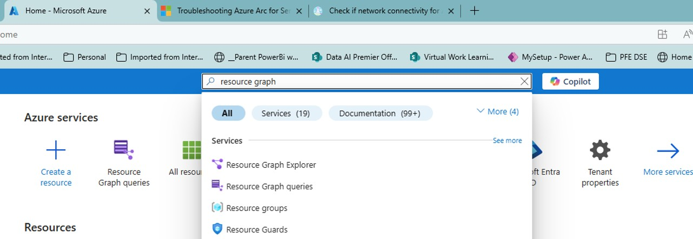
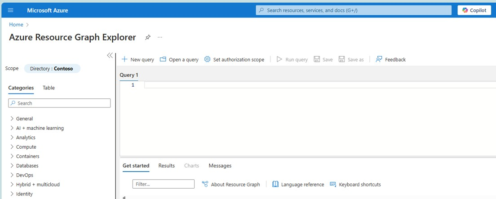
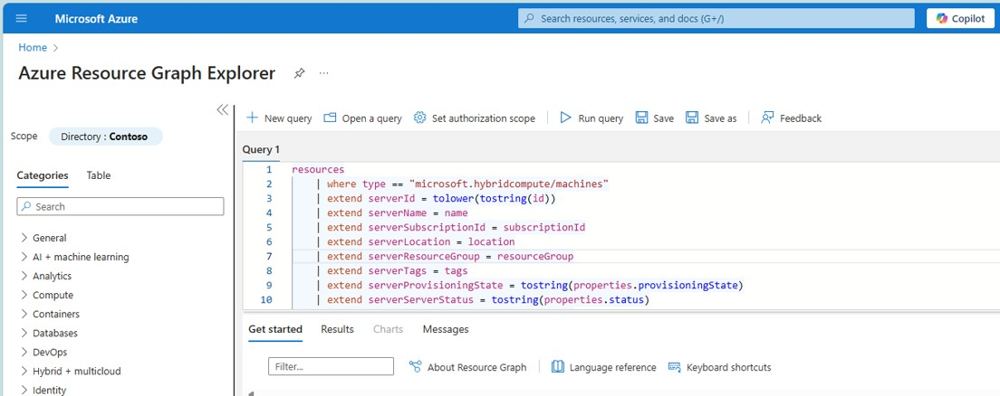
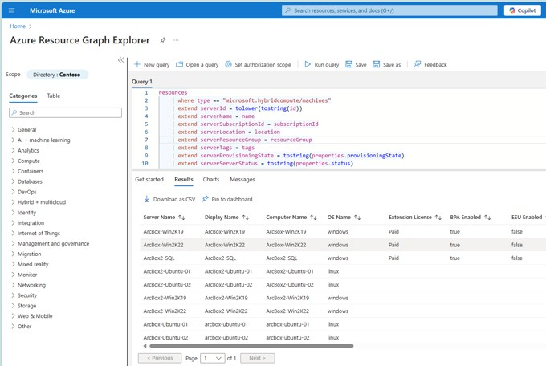

## Step-1 Identify Servers with SQL Server installed that are deemed as DPS BLOCKED
go to Azure Portal, and open Resource Graph Explorer 

1. type Resource Graph at search bar 
2. Click on Resource Graph Explorer 

3. Azure Resource Graph explorer screen will show with an empty query 

 

4. Copy/Paste the KQL query from the file "01_KQL_query_to_obtain_list_of_resources.KQL" located on SCRIPTS folder

5. the screen will look like: 

 

6. Execute the Query by clicking at the [Run Query] button at the toolbar  

7. Results will be shown at the results panel below the query, as seen in the image below: 

 
scroll to the right to find the column **Server Status**

