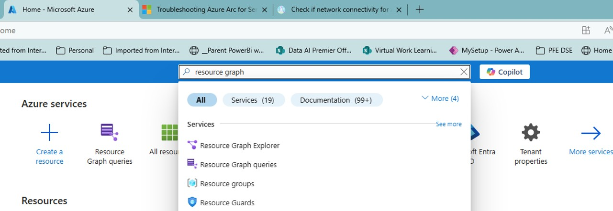

## Step-1 Identify Servers with SQL Server installed that are presenting issues
go to Azure Portal, and open Resource Graph Explorer<br>



1. type Resource Graph at search bar<br>
2. Click on Resource Graph Explorer<br>

3. Azure Resource Graph explorer screen will show with an empty query<br>


<br>

4. Copy/Paste the KQL query from the file "01_KQL_query_to_obtain_list_of_resources.KQL" located on SCRIPTS folder

5. the screen will look like:<br>

<br>

6. Execute the Query by clicking at the [Run Query] button at the toolbar<br>

7. Results will be shown at the results panel below the query, as seen in the image below:<br>

<br>

8. scroll to the right to find the column **DPS Status**<br>
* look for entries not showing DPS Status **OK**<br>
* alternatively edit the KQL query to add a filter by removing the comment sign (//) leading the line 69:<br>
```
//| where ['DPS Status'] != "OK"
```
<br>

9. Navigate to the following steps should the VM present the following situations:<br>

For **DPS Status not OK**, or for **TLS related issues**  go to [Step-01-fix-Connectivity.md](Step-01-fix-Connectivity.md)<br>
For SQL Extension State not Healthy go to [Step-01-fix-SQLExtension.md](Step-01-fix-SQLExtension.md)<br>


