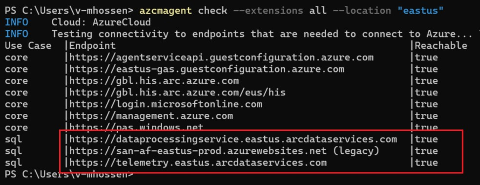

# Communication Issues

## How to verify communication issues

Connect to the VM having communication issues<br>
open an elevated DOS prompt or PowerShell<br><br>
Issue the following command: <br>
```
azcmagent check --extensions all --location “<region>”
```
Replace "\<region\>\" with the appropriate region name, for example eastus as illustrated below<br>

 <br>

> [!NOTE]
> As it can be seen on the last 3 rows of the above image, the column **Reachable** shows **false** indicating there is a problem to reach these endpoints. <br>

### Data Processing Service (DPS) endpoint

The collected inventory information about SQL Server instances, databases, availability groups, and usage data for billing purposes is sent to this endpoint.<br>
Endpoint name :`dataprocessingservice.[Region].arcdataservices.com , Port : 443`

### Telemetry endpoint performance dashboard

The Azure Connected Machine agent logs, the Azure extension for SQL Server logs, and Dynamic Management Views (DMV) data is sent to this endpoint.<br>
The Communication to these endpoints uses HTTPS with SSL/TLS and port TCP/443 for encrypted secure connections. The agent initiates communication to send the data to Azure. Azure never initiates communication
Endpoint name :<br>
```
Telemetry.[Region].arcdataservices.com   Port : 443
San-af-[Region]-prod.azurewebsites.net  Port : 443
```

## How to Fix communication issues

Work with the networking team to add the URLs to the whitelist, the required port to be opened is 443

once firewall settings take effect, running the same azcmagent command above will present the following output:<br>

 <br>

## How to Fix TLS Version

if the report above shows TLS version that needs to be changed, open a PowerShell prompt and run the following command:
```
"[Net.ServicePointManager]::SecurityProtocol = [Net.SecurityProtocolType]::Tls12"    
```

# for MD Manir to check
How can we be sure the TLS has changed correctly?
I found this PowerShell script to validate. On my machine TLS is 1.3 I changed to 1.2 and azcnd didn't show it was moved from 1.3 to 1.2
```
[Net.ServicePointManager]::SecurityProtocol = [Net.SecurityProtocolType]::Tls13

$response = Invoke-WebRequest -Uri "https://www.howsmyssl.com/a/check" -UseBasicParsing
$content = $response.Content | ConvertFrom-Json
$content.tls_version
```
this shows that it was moved to 1.2 and then the report shows 1.2<br>
but when I run `azcmagent check --extensions all --location "eastus"` it shows it is 1.3<br>
actually when I closed that PowerShell window and opened a new one to run the test again, it was back to 1.3

