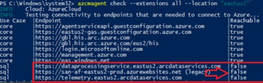

# DPS Issues

go to the VM deemed as having DPS issues<br>
open an elevated DOS prompt or PowerShell<br>
issue the command: <br>
```
azcmagent check --extensions all --location “<region>”
```
replace \"\<region\>\" with the appropriate region name, for example eastus as illustrated below<br>

 <br>

:red_circle:As it can be seen on the last 3 rows of the image, the column **Reachable** shows **false** indicating there is a problem to reach these endpoints. <br>


