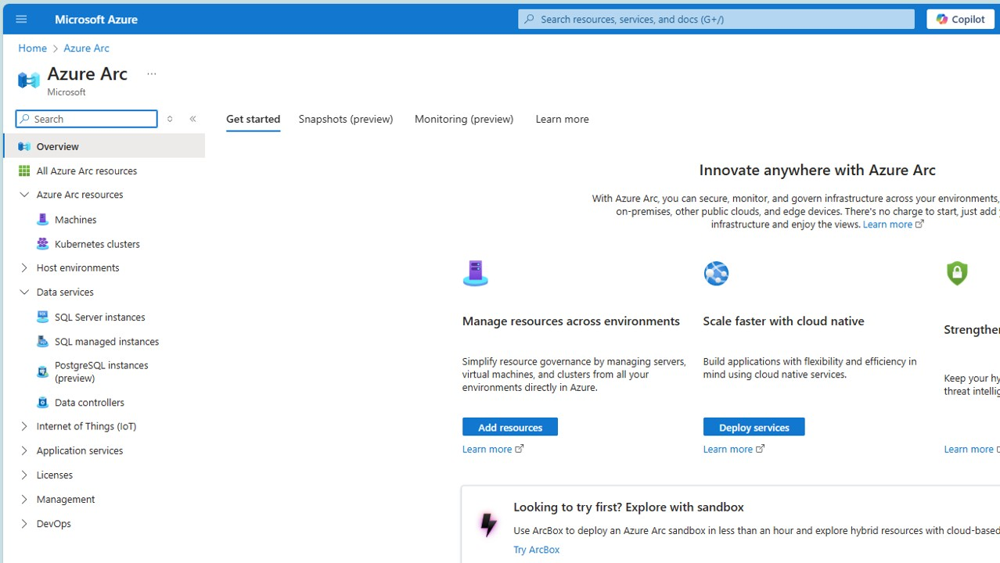
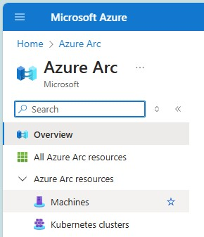
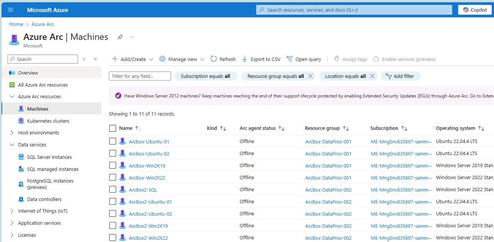
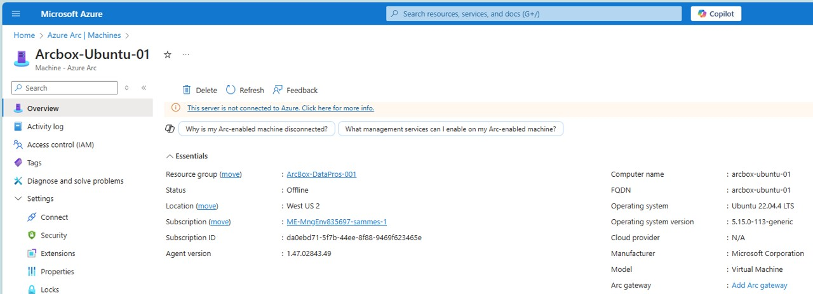
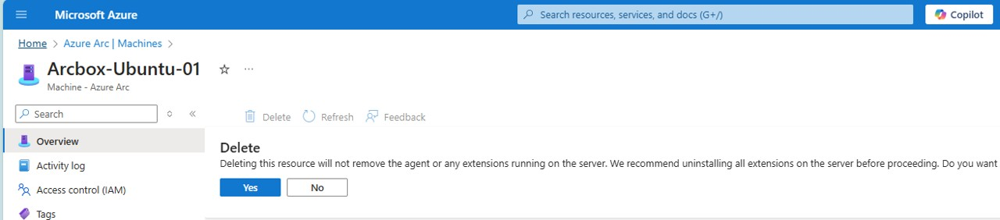
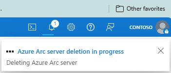

## Step-2 Eliminate Decommissioned machines
B. go to your Azure Portal, and open Azure Arc 

B.1. type Azure Arc at search bar 
B.2. Click on Azure Arc 

B.3. Azure Arc screen will display 

 

B.4. At the left bar, Select Machines from the Azure Arc resources 

 

B.5. All registered machines will be displayed 

 

B.6. using the listing, identify the Machine to be deleted and click on its name (left most column)  
B.7. Details of that machine will be shown  

 

B.8. A confirmation dialog will pop up. Click on YES 

 

B.9. Observe the notification at the top right of the portal 

 

B.7. Once all machines are selected, click at the 
