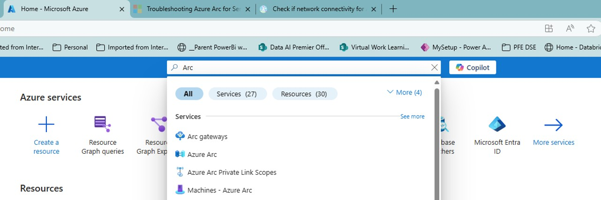

# Step-2 Eliminate Decommissioned machines
## to delete machines manually one-by-one  

go to your Azure Portal, and open Azure Arc 

1. type Azure Arc at search bar 
2. Click on Azure Arc 

3. Azure Arc screen will display 

 

4. At the left bar, Select Machines from the Azure Arc resources 

 

5. All registered machines will be displayed 

 

6. using the listing, identify the Machine to be deleted and click on its name (left most column)  
7. Details of that machine will be shown  

 

8. A confirmation dialog will pop up. Click on YES 

 

9. Observe the notification at the top right of the portal 

 

10. Once that machines is deleted, the portal will display a confirmation at the notification panel 

 
11. Dismiss that notification 
 
 
## to delete machines at scale  
### Using PowerShell 
1. Open PowerShell: Ensure you have the Azure PowerShell module installed. If not, you can install it using: 
Install-Module -Name Az -AllowClobber -Scope CurrentUser 
 
2. Confirm the prompt 
 
3. Connect to your Azure account: 
Connect-AzAccount 
 
Select the account to Login using the browser 
 
4. Delete the Azure Arc resource: 
Remove-AzResource -ResourceId "/subscriptions/{subscription-id}/resourceGroups/{resource-group-name}/providers/Microsoft.HybridCompute/machines/{resource-name}" -Force 
Replace {subscription-id}, {resource-group-name}, and {resource-name} with your specific detail 
 
After few seconds the resource is deleted and PowerShell replies confirming: 
 

### Using Azure CLI 
1. Open your command line interface: Ensure you have the Azure CLI installed. If not, you can install it from the An external link was removed to protect your privacy.. 
2. Log in to your Azure account: 
az login 
3. Delete the Azure Arc resource: 
az resource delete --ids "/subscriptions/{subscription-id}/resourceGroups/{resource-group-name}/providers/Microsoft.HybridCompute/machines/{resource-name}" 
Replace {subscription-id}, {resource-group-name}, and {resource-name} with your specific details. 

