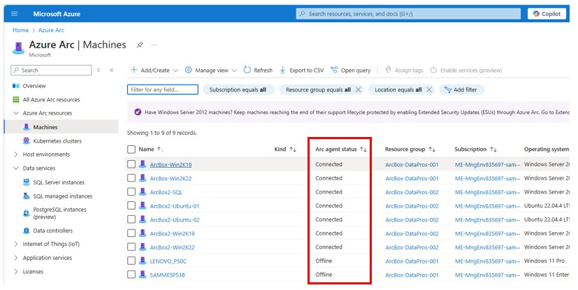

# Step-3 Re-onboard machines showing 'Expired' on Status column

The Arc-enabled machine must be re-onboarded to Arc, as the certificate used to authenticate to Azure has expired. 

## go to your Azure Portal, and open Azure Arc 

1. type Azure Arc at search bar 
2. Click on Azure Arc 

3. Azure Arc screen will display 

 

4. At the left bar, Select Machines from the Azure Arc resources 

 

5. If there are any machines with that status they will display 'Expired’ in the Agent Status column highlighted below.  

 

6. Uninstall the agent by following the documentation [here](https://learn.microsoft.com/en-us/azure/azure-arc/servers/manage-agent?WT.mc_id=itopstalk-blog-socuff&tabs=windows#uninstall-the-agent) 

7. Re-onboard those machines following instructions [here](https://learn.microsoft.com/en-us/azure/azure-arc/servers/deployment-options). 

   *NOTE: There is no need to delete the Arc-enabled SQL Server resources in the portal if you are just re-onboarding.*
