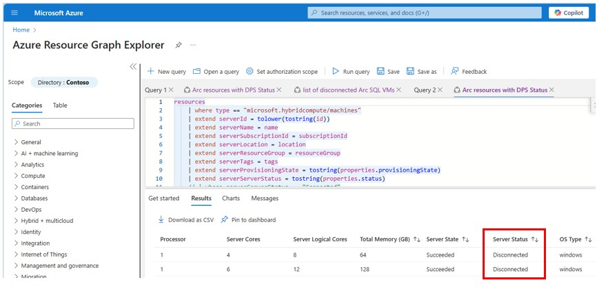

# Step-4 Fix machines showing '**disconnected**' on Status column

This could be for a variety of reasons: Arc connected machine agent is stopped, disabled or constantly crashing OR it could be that the connectivity is blocked between the agent and Azure.
 

A.1. type Resource Graph at search bar 
A.2. Click on Resource Graph Explorer 

A.3. Azure Resource Graph explorer screen will show with an empty query 

 

A.4. Copy/Paste the KQL query from the file 01_KQL_query_to_obtain_list_of_resources.KQL 
A.5. the screen will look like: 

 
A.6. Execute the Query by clicking at the [Run Query] button at the toolbar 
A.7. Results will be shown at the results panel below the query, as seen in the image below: 

 

## go to Azure Portal, and open Azure Arc 

1. type Azure Arc at search bar 
2. Click on Azure Arc 

3. Azure Arc screen will display 

 

4. At the left bar, Select Machines from the Azure Arc resources 

 

5. If there are any machines with that status they will display 'Disconnected’ in the Agent Status column highlighted below.  

 

Alternatively, you can open Resource Graph Explorer and load the [query](scripts/02_KQL_query_to_obtain_list_of_DisconnectedMachines.KQL)

6. Uninstall the agent by following the documentation [here](https://learn.microsoft.com/en-us/azure/azure-arc/servers/manage-agent?WT.mc_id=itopstalk-blog-socuff&tabs=windows#uninstall-the-agent) 

7. Re-onboard those machines following instructions [here](https://learn.microsoft.com/en-us/azure/azure-arc/servers/deployment-options). 

   *NOTE: There is no need to delete the Arc-enabled SQL Server resources in the portal if you are just re-onboarding.*

